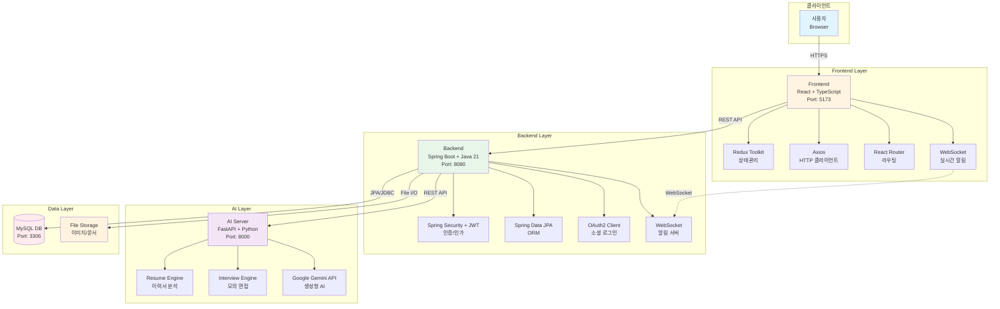
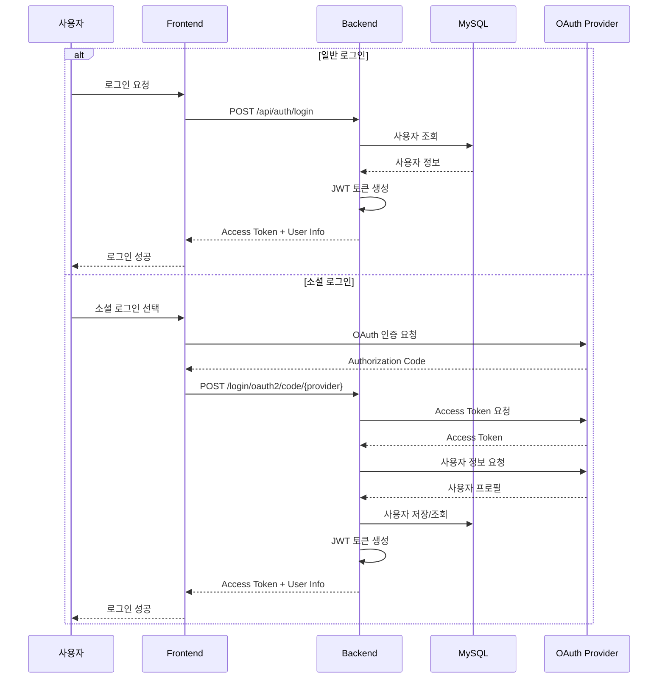
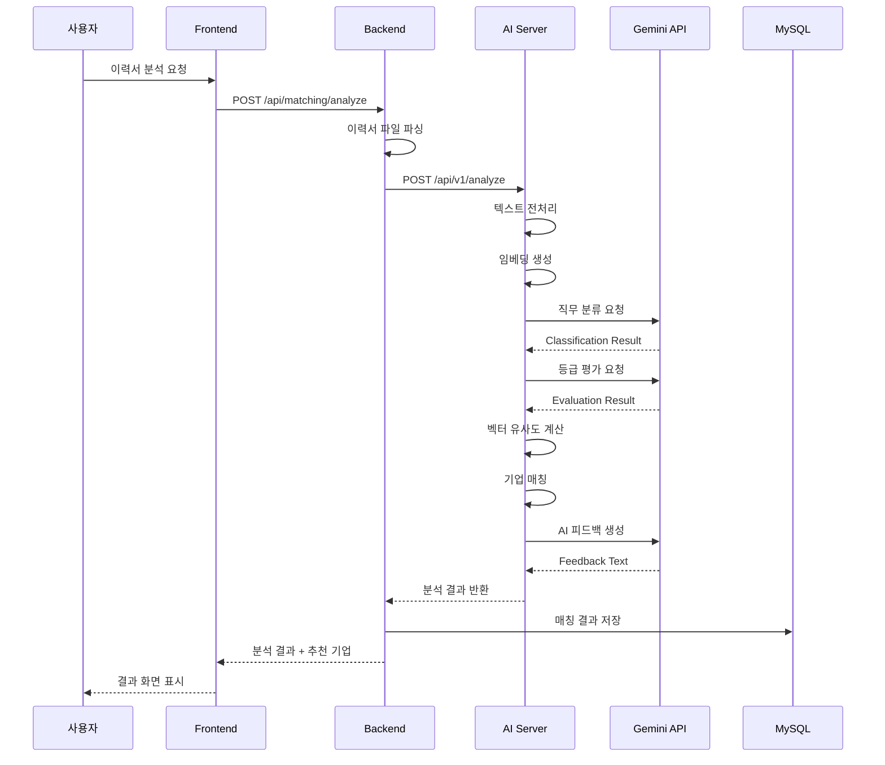
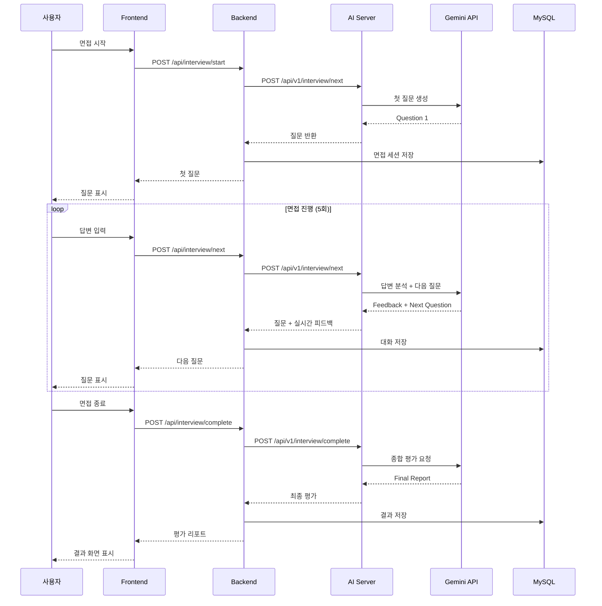
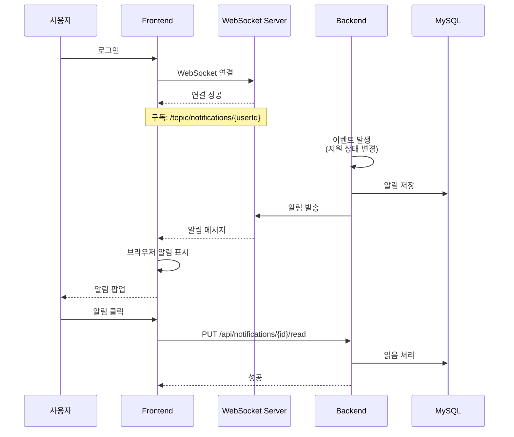
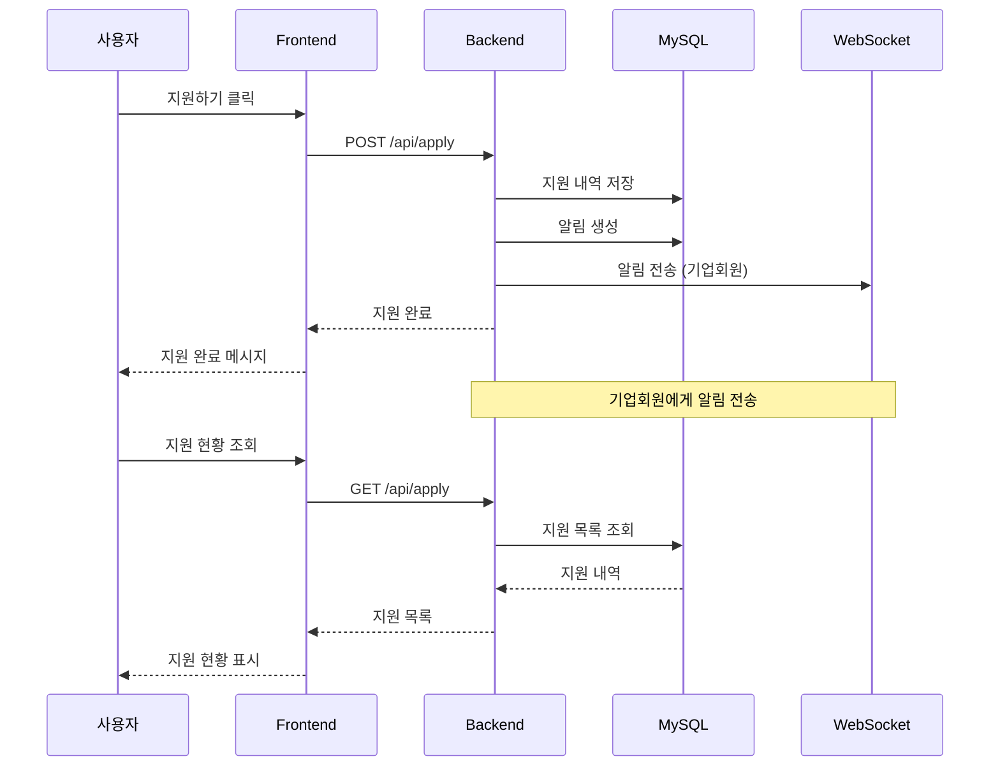
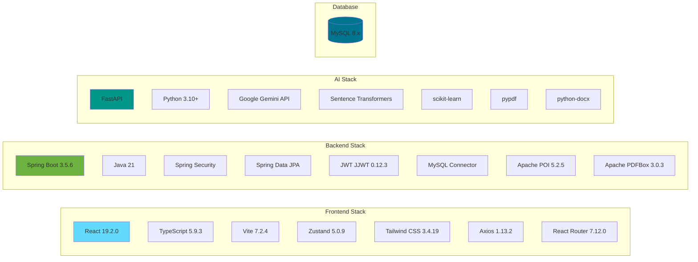
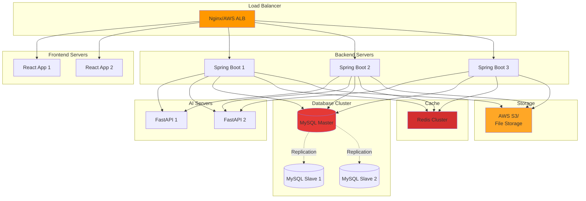

# NextEnter 시스템 아키텍처

## 전체 구조도


## 상세 데이터 흐름

### 1. 사용자 인증 흐름


### 2. AI 이력서 분석 흐름


### 3. AI 모의면접 흐름


### 4. 실시간 알림 흐름


### 5. 채용공고 지원 흐름


## 기술 스택 매핑


## 배포 아키텍처 (프로덕션)


# NextEnter Frontend

> React 기반 AI 채용 플랫폼 프론트엔드

## 📋 프로젝트 개요

NextEnter는 AI 기술을 활용한 채용 플랫폼의 프론트엔드 애플리케이션입니다.
구직자와 기업회원을 위한 직관적인 UI/UX를 제공하며, 이력서 관리, AI 매칭, 모의 면접 등 다양한 기능을 지원합니다.

## 🛠️ 기술 스택

### Core
- **Language**: TypeScript 5.9.3
- **Framework**: React 19.2.0
- **Build Tool**: Vite 7.2.4
- **Routing**: React Router DOM 7.12.0

### State Management
- **Zustand 5.0.9**: 가볍고 직관적인 상태 관리

### Styling
- **Tailwind CSS 3.4.19**: 유틸리티 우선 CSS 프레임워크
- **PostCSS 8.4.47**: CSS 후처리
- **Autoprefixer 10.4.20**: 벤더 프리픽스 자동 추가

### HTTP & WebSocket
- **Axios 1.13.2**: HTTP 클라이언트
- **@stomp/stompjs 7.2.1**: WebSocket STOMP 프로토콜
- **sockjs-client 1.6.1**: WebSocket 폴백

### Development
- **@vitejs/plugin-react-swc**: Fast Refresh with SWC
- **ESLint 9.39.1**: 코드 품질 관리
- **TypeScript ESLint**: TypeScript 린팅

### Utilities
- **date-fns 2.30.0**: 날짜 처리 라이브러리

## 📂 프로젝트 구조
```
nextenterfront/
├── public/                              # 정적 파일
│   └── images/                          # 이미지 리소스
│       ├── companies/                   # 기업 로고/썸네일
│       ├── posting/                     # 공고 이미지
│       └── profile-images/              # 프로필 이미지
│
├── src/
│   ├── api/                             # API 서비스
│   │   ├── axios.ts                     # Axios 인스턴스
│   │   ├── auth.ts                      # 인증 API
│   │   ├── user.ts                      # 사용자 API
│   │   ├── company.ts                   # 기업 API
│   │   ├── job.ts                       # 채용공고 API
│   │   ├── resume.ts                    # 이력서 API
│   │   ├── coverletter.ts               # 자기소개서 API
│   │   ├── apply.ts                     # 지원 API
│   │   ├── bookmark.ts                  # 북마크 API
│   │   ├── ai.ts                        # AI 분석 API
│   │   ├── matching.ts                  # 매칭 API
│   │   ├── interviewService.ts          # 면접 API
│   │   ├── interviewOffer.ts            # 면접 제안 API
│   │   ├── credit.ts                    # 크레딧 API
│   │   ├── payment.ts                   # 결제 API
│   │   ├── notification.ts              # 알림 API
│   │   ├── talent.ts                    # 인재 검색 API
│   │   ├── contact.ts                   # 연락처 API
│   │   ├── advertisement.ts             # 광고 API
│   │   └── application.ts               # 지원 통합 API
│   │
│   ├── components/                      # 공통 컴포넌트
│   │   ├── Header.tsx                   # 헤더
│   │   ├── Footer.tsx                   # 푸터
│   │   ├── LeftSidebar.tsx              # 사이드바
│   │   ├── Navigation.tsx               # 네비게이션
│   │   ├── NotificationIcon.tsx         # 알림 아이콘
│   │   ├── NotificationPopup.tsx        # 알림 팝업
│   │   ├── ProtectedRoute.tsx           # 보호된 라우트
│   │   ├── ScrollToTop.tsx              # 스크롤 최상단 이동
│   │   ├── ChangePasswordModal.tsx      # 비밀번호 변경 모달
│   │   ├── JobCard.tsx                  # 채용공고 카드
│   │   ├── JobImageCard.tsx             # 이미지형 공고 카드
│   │   └── job/
│   │       └── JobCard.tsx              # 공고 카드 (별도 버전)
│   │
│   ├── features/                        # 개인회원 기능
│   │   ├── home/                        # 홈페이지
│   │   │   ├── HomePage.tsx
│   │   │   └── components/
│   │   ├── mypage/                      # 마이페이지
│   │   │   ├── ImprovedMyPage.tsx
│   │   │   ├── MyPage.tsx
│   │   │   ├── ProfilePage.tsx
│   │   │   └── components/
│   │   ├── resume/                      # 이력서 관리
│   │   │   ├── ResumePage.tsx
│   │   │   ├── ResumeDetailPage.tsx
│   │   │   └── ResumeFormPage.tsx
│   │   ├── coverletter/                 # 자기소개서
│   │   │   ├── CoverLetterPage.tsx
│   │   │   ├── CoverLetterDetailPage.tsx
│   │   │   └── CoverLetterFormPage.tsx
│   │   ├── all-jobs/                    # 채용공고 보기
│   │   │   ├── AllJobsPage.tsx
│   │   │   ├── AIRecommendedJobsPage.tsx
│   │   │   ├── PositionJobsPage.tsx
│   │   │   ├── LocationJobsPage.tsx
│   │   │   ├── UserJobDetailPage.tsx
│   │   │   └── components/
│   │   ├── ai-recommendation/           # AI 추천
│   │   │   └── AIRecommendationPage.tsx
│   │   ├── matching/                    # AI 매칭
│   │   │   ├── MatchingPage.tsx
│   │   │   ├── components/
│   │   │   └── data/
│   │   ├── interview/                   # AI 모의면접
│   │   │   ├── InterviewPage.tsx
│   │   │   ├── InterviewResultPage.tsx
│   │   │   └── components/
│   │   ├── offer/                       # 면접 제안
│   │   │   ├── OfferPage.tsx
│   │   │   └── InterViewOfferPage.tsx
│   │   ├── application-status/          # 지원 현황
│   │   │   └── ApplicationStatusPage.tsx
│   │   ├── scrap-status/                # 스크랩 현황
│   │   │   └── ScrapStatusPage.tsx
│   │   ├── credit/                      # 크레딧
│   │   │   └── CreditPage.tsx
│   │   ├── credit-charge/               # 크레딧 충전
│   │   │   └── CreditChargePage.tsx
│   │   ├── payment-complete/            # 결제 완료
│   │   │   └── PaymentCompletePage.tsx
│   │   ├── navigation-menu/             # 네비게이션 메뉴
│   │   │   ├── components/
│   │   │   ├── data/
│   │   │   └── types.ts
│   │   └── company/                     # 기업 서비스
│   │       └── business-service/
│   │
│   ├── features-company/                # 기업회원 기능
│   │   ├── home/                        # 기업 홈페이지
│   │   │   └── CompanyHomePage.tsx
│   │   ├── company-mypage/              # 기업 마이페이지
│   │   │   ├── CompanyMyPage.tsx
│   │   │   └── components/
│   │   ├── jobs/                        # 채용공고 관리
│   │   │   ├── AllJobPostingsPage.tsx
│   │   │   ├── JobManagementPage.tsx
│   │   │   ├── JobPostingCreatePage.tsx
│   │   │   ├── JobPostingEditPage.tsx
│   │   │   ├── JobPostingDetailPage.tsx
│   │   │   └── components/
│   │   ├── applicants/                  # 지원자 관리
│   │   │   ├── ApplicantManagementPage.tsx
│   │   │   ├── ApplicantDetailPage.tsx
│   │   │   └── ApplicantCompatibilityPage.tsx
│   │   ├── talent-search/               # 인재 검색
│   │   │   ├── TalentSearchPage.tsx
│   │   │   ├── ScrapTalentPage.tsx
│   │   │   ├── TalentResumeDetailPage.tsx
│   │   │   └── components/
│   │   ├── credit/                      # 기업 크레딧
│   │   │   ├── BusinessCreditPage.tsx
│   │   │   └── BusinessCreditChargePage.tsx
│   │   ├── components/                  # 기업 전용 컴포넌트
│   │   │   ├── CompanyHeader.tsx
│   │   │   ├── CompanyFooter.tsx
│   │   │   ├── CompanyLeftSidebar.tsx
│   │   │   └── CompanyJobPostingCard.tsx
│   │   ├── navigation-menu/             # 기업 네비게이션
│   │   │   ├── components/
│   │   │   └── data/
│   │   ├── hooks/                       # 기업 전용 훅
│   │   │   └── useCompanyPageNavigation.ts
│   │   └── pages/                       # 기업 페이지
│   │       └── CompanyNotificationsPage.tsx
│   │
│   ├── pages/                           # 공통 페이지
│   │   ├── LoginPage.tsx                # 로그인
│   │   ├── Signup.tsx                   # 회원가입
│   │   ├── ForgotPasswordPage.tsx       # 비밀번호 찾기
│   │   ├── OAuth2CallbackPage.tsx       # OAuth2 콜백
│   │   ├── ProfilePage.tsx              # 프로필
│   │   ├── ProfileEditPage.tsx          # 프로필 수정
│   │   └── UserNotificationsPage.tsx    # 알림 페이지
│   │
│   ├── layouts/                         # 레이아웃
│   │   ├── UserLayout.tsx               # 개인회원 레이아웃
│   │   └── CompanyLayout.tsx            # 기업회원 레이아웃
│   │
│   ├── stores/                          # Zustand 스토어
│   │   ├── authStore.ts                 # 인증 상태
│   │   ├── jobStore.ts                  # 채용공고 상태
│   │   ├── resumeStore.ts               # 이력서 상태
│   │   ├── interviewStore.ts            # 면접 상태
│   │   ├── creditStore.ts               # 크레딧 상태
│   │   └── offerStore.ts                # 제안 상태
│   │
│   ├── hooks/                           # 커스텀 훅
│   │   ├── usePageNavigation.ts         # 페이지 네비게이션
│   │   ├── useWebSocket.ts              # WebSocket 훅
│   │   ├── useNotificationWebSocket.ts  # 알림 WebSocket
│   │   └── useKakaoAddress.ts           # 카카오 주소 검색
│   │
│   ├── services/                        # 서비스
│   │   └── websocket.ts                 # WebSocket 서비스
│   │
│   ├── utils/                           # 유틸리티
│   │   ├── authGuard.ts                 # 인증 가드
│   │   └── navigationBlocker.ts         # 네비게이션 차단
│   │
│   ├── constants/                       # 상수
│   │   └── jobConstants.ts              # 채용 관련 상수
│   │
│   ├── App.tsx                          # 메인 앱
│   ├── main.tsx                         # 엔트리 포인트
│   ├── App.css                          # 앱 스타일
│   └── index.css                        # 글로벌 스타일
│
├── index.html                           # HTML 템플릿
├── package.json                         # 의존성 관리
├── tsconfig.json                        # TypeScript 설정
├── vite.config.ts                       # Vite 설정
├── tailwind.config.js                   # Tailwind 설정
├── postcss.config.js                    # PostCSS 설정
└── eslint.config.js                     # ESLint 설정
```

## 🔑 핵심 기능

### 1. 인증 및 회원관리
- **로그인/회원가입**
  - 이메일 기반 일반 회원가입
  - 소셜 로그인 (카카오, 네이버, 구글)
  - 이메일 인증
- **회원 유형**
  - 개인회원 (/user 경로)
  - 기업회원 (/company 경로)
- **프로필 관리**
  - 프로필 정보 수정
  - 비밀번호 변경
  - 회원 탈퇴
```typescript
// 인증 스토어 예시
interface AuthState {
  user: User | null;
  token: string | null;
  isAuthenticated: boolean;
  login: (credentials: LoginRequest) => Promise<void>;
  logout: () => void;
  updateProfile: (data: ProfileUpdate) => Promise<void>;
}

export const useAuthStore = create<AuthState>((set) => ({
  user: null,
  token: localStorage.getItem('token'),
  isAuthenticated: false,
  
  login: async (credentials) => {
    const response = await authAPI.login(credentials);
    set({ user: response.user, token: response.token, isAuthenticated: true });
    localStorage.setItem('token', response.token);
  },
  
  logout: () => {
    set({ user: null, token: null, isAuthenticated: false });
    localStorage.removeItem('token');
  },
  
  updateProfile: async (data) => {
    const updated = await userAPI.updateProfile(data);
    set((state) => ({ user: { ...state.user, ...updated } }));
  }
}));
```

### 2. 채용공고 (개인회원)
- **공고 탐색**
  - 전체 공고 보기
  - AI 추천 공고
  - 직무별/지역별 필터링
  - 키워드 검색
- **공고 상세**
  - 공고 상세 정보
  - 회사 정보
  - 지원하기
  - 북마크
- **북마크 관리**
  - 관심 공고 저장
  - 북마크 목록

### 3. 이력서 관리
- **이력서 CRUD**
  - 이력서 작성/수정/삭제
  - 다중 이력서 관리
  - 공개/비공개 설정
- **이력서 파일 업로드**
  - PDF, DOCX 지원
  - 자동 텍스트 추출
- **포트폴리오**
  - 프로젝트 경력 추가
  - 파일 첨부

### 4. AI 기능
- **이력서 분석**
  - 직무 적합도 분석
  - 강점/약점 분석
  - 개선 제안
- **기업 매칭**
  - AI 기반 맞춤 기업 추천
  - 매칭 점수 제공
  - 매칭 히스토리
- **모의 면접**
  - 대화형 AI 면접
  - 실시간 피드백
  - 종합 평가 리포트
  - 면접 히스토리
```typescript
// 면접 진행 예시
const [chatHistory, setChatHistory] = useState<ChatMessage[]>([]);
const [currentQuestion, setCurrentQuestion] = useState<string>('');
const [isComplete, setIsComplete] = useState(false);

const handleAnswer = async (answer: string) => {
  const newMessage = { role: 'user', content: answer };
  const updatedHistory = [...chatHistory, newMessage];
  setChatHistory(updatedHistory);
  
  if (updatedHistory.length >= 10) {
    // 면접 종료
    const result = await interviewAPI.complete({
      id: interviewId,
      chat_history: updatedHistory
    });
    setIsComplete(true);
    navigate('/user/interview/result', { state: { result } });
  } else {
    // 다음 질문
    const response = await interviewAPI.next({
      id: interviewId,
      last_answer: answer,
      chat_history: updatedHistory
    });
    setCurrentQuestion(response.realtime.question);
    setChatHistory([...updatedHistory, 
      { role: 'assistant', content: response.realtime.question }
    ]);
  }
};
```

### 5. 지원 및 제안
- **지원하기**
  - 이력서 선택 지원
  - 지원 상태 추적
- **지원 현황**
  - 지원 내역 조회
  - 상태별 필터링
- **면접 제안**
  - 기업으로부터 면접 제안 수신
  - 제안 수락/거절

### 6. 기업회원 기능
- **채용공고 관리**
  - 공고 등록/수정/삭제
  - 공고 목록 관리
- **지원자 관리**
  - 지원자 목록 조회
  - 지원서 상세 보기
  - AI 적합도 분석
  - 상태 변경 (서류통과, 면접대기 등)
- **인재 검색**
  - 이력서 검색
  - 필터링 (경력, 기술스택, 지역 등)
  - 인재 스크랩
- **면접 제안**
  - 지원자에게 면접 제안
  - 제안 관리

### 7. 실시간 알림 (WebSocket)
- **알림 유형**
  - 지원 상태 변경
  - 면접 제안 수신
  - 북마크 공고 마감 임박
  - 새로운 추천 공고
- **알림 설정**
  - 알림 타입별 on/off
  - 실시간 푸시 알림
- **알림 센터**
  - 알림 목록
  - 읽음 처리
  - 알림 삭제
```typescript
// WebSocket 연결 예시
export const useNotificationWebSocket = () => {
  const { user } = useAuthStore();
  const [notifications, setNotifications] = useState<Notification[]>([]);
  
  useEffect(() => {
    if (!user) return;
    
    const client = new Client({
      brokerURL: 'ws://localhost:8080/ws',
      onConnect: () => {
        client.subscribe(`/topic/notifications/${user.id}`, (message) => {
          const notification = JSON.parse(message.body);
          setNotifications(prev => [notification, ...prev]);
          
          // 브라우저 알림
          if (Notification.permission === 'granted') {
            new Notification(notification.title, {
              body: notification.message
            });
          }
        });
      }
    });
    
    client.activate();
    
    return () => client.deactivate();
  }, [user]);
  
  return { notifications };
};
```

### 8. 크레딧 및 결제
- **크레딧 시스템**
  - 크레딧 잔액 조회
  - 사용 내역
- **크레딧 충전**
  - 충전 금액 선택
  - 결제 수단 선택
- **결제 연동**
  - 카카오페이, 네이버페이, 토스페이
  - PortOne 결제 시스템

## 🚀 시작하기

### 필수 요구사항
- Node.js 18.x 이상
- npm 또는 yarn

### 설치 및 실행

1. **저장소 클론**
```bash
git clone https://github.com/yourusername/NextEnterFront.git
cd NextEnterFront
```

2. **의존성 설치**
```bash
npm install
# 또는
yarn install
```

3. **환경 변수 설정**
`.env` 파일 생성:
```env
VITE_API_URL=http://localhost:8080/api
VITE_WS_URL=ws://localhost:8080/ws
VITE_KAKAO_API_KEY=your_kakao_api_key
```

4. **개발 서버 실행**
```bash
npm run dev
# 또는
yarn dev
```

애플리케이션은 기본적으로 `http://localhost:5173`에서 실행됩니다.

### 프로덕션 빌드
```bash
npm run build
# 또는
yarn build
```

빌드된 파일은 `dist/` 디렉토리에 생성됩니다.

## 🎨 디자인 시스템

### Tailwind CSS 커스터마이징
```javascript
// tailwind.config.js
export default {
  content: ['./index.html', './src/**/*.{js,ts,jsx,tsx}'],
  theme: {
    extend: {
      colors: {
        primary: {
          50: '#f0f9ff',
          500: '#0ea5e9',
          600: '#0284c7',
          700: '#0369a1',
        },
        // ...
      },
      fontFamily: {
        sans: ['Pretendard', 'sans-serif'],
      },
    },
  },
  plugins: [],
};
```

### 반응형 디자인
- 모바일: 320px ~ 767px
- 태블릿: 768px ~ 1023px
- 데스크톱: 1024px 이상

## 📱 라우팅 구조
```typescript
// App.tsx
<Routes>
  {/* 개인회원 영역 */}
  <Route path="/user" element={<UserLayout />}>
    <Route index element={<HomePage />} />
    <Route path="login" element={<LoginPage />} />
    <Route path="signup" element={<SignupPage />} />
    
    {/* 보호된 라우트 */}
    <Route path="mypage" element={
      <ProtectedRoute allowedUserType="personal">
        <MyPage />
      </ProtectedRoute>
    } />
    
    <Route path="resume" element={
      <ProtectedRoute allowedUserType="personal">
        <ResumePage />
      </ProtectedRoute>
    } />
    
    {/* ... */}
  </Route>
  
  {/* 기업회원 영역 */}
  <Route path="/company" element={<CompanyLayout />}>
    <Route index element={<CompanyHomePage />} />
    <Route path="login" element={<LoginPage initialAccountType="business" />} />
    
    {/* 보호된 라우트 */}
    <Route path="jobs" element={
      <ProtectedRoute allowedUserType="company">
        <JobManagementPage />
      </ProtectedRoute>
    } />
    
    {/* ... */}
  </Route>
</Routes>
```

## 🔒 보안

### 1. 인증 토큰 관리
- localStorage에 JWT 토큰 저장
- Axios Interceptor를 통한 자동 토큰 추가
- 토큰 만료 시 자동 로그아웃
```typescript
// axios.ts
axios.interceptors.request.use((config) => {
  const token = localStorage.getItem('token');
  if (token) {
    config.headers.Authorization = `Bearer ${token}`;
  }
  return config;
});

axios.interceptors.response.use(
  (response) => response,
  (error) => {
    if (error.response?.status === 401) {
      localStorage.removeItem('token');
      window.location.href = '/user/login';
    }
    return Promise.reject(error);
  }
);
```

### 2. XSS 방지
- React의 기본 XSS 방어
- 사용자 입력 검증
- DOMPurify 사용 (필요 시)

### 3. 보호된 라우트
- ProtectedRoute 컴포넌트로 인증 확인
- 회원 유형별 접근 제어

## 🐛 트러블슈팅

### 1. CORS 에러
**증상**: Network Error 또는 CORS policy 에러

**해결**: 백엔드 CORS 설정 확인 또는 Vite 프록시 설정
```typescript
// vite.config.ts
export default defineConfig({
  server: {
    proxy: {
      '/api': {
        target: 'http://localhost:8080',
        changeOrigin: true,
      }
    }
  }
});
```

### 2. WebSocket 연결 실패
**증상**: WebSocket connection failed

**해결**: WebSocket URL 및 백엔드 WebSocket 설정 확인

### 3. 빌드 에러
**증상**: Type errors during build

**해결**: TypeScript 타입 정의 확인 및 수정

## 📝 개발 가이드

### 코드 컨벤션
- **파일명**: PascalCase (컴포넌트), camelCase (유틸)
- **컴포넌트**: PascalCase
- **함수/변수**: camelCase
- **상수**: UPPER_SNAKE_CASE
```typescript
// 좋은 예
const API_BASE_URL = 'http://localhost:8080/api';

const JobCard: React.FC<JobCardProps> = ({ job }) => {
  const handleApply = () => {
    // ...
  };
  
  return <div className="job-card">{/* ... */}</div>;
};
```

### Git 커밋 컨벤션
```
feat: 새로운 기능
fix: 버그 수정
docs: 문서 수정
style: 코드 포맷팅
refactor: 리팩토링
test: 테스트 코드
chore: 빌드, 설정

예시:
feat: 이력서 업로드 기능 추가
fix: 로그인 버그 수정
docs: README 업데이트
```

## 🤝 기여 방법

1. Fork the Project
2. Create your Feature Branch (`git checkout -b feature/AmazingFeature`)
3. Commit your Changes (`git commit -m 'feat: Add some AmazingFeature'`)
4. Push to the Branch (`git push origin feature/AmazingFeature`)
5. Open a Pull Request

## 📄 라이선스

이 프로젝트는 MIT 라이선스를 따릅니다.

## 👥 개발자 정보

- **GitHub**: https://github.com/yourusername/NextEnterFront
- **이메일**: dltkddus50@naver.com

---

**NextEnter** - AI가 만드는 새로운 채용 경험
